# Intune Endpoint Management Lab

A standalone Microsoft Intune deployment demonstrating device configuration, compliance enforcement, required app deployment, and Conditional Access tied to device trust — built in its own tenant, separate from the AD DS and hybrid identity projects.

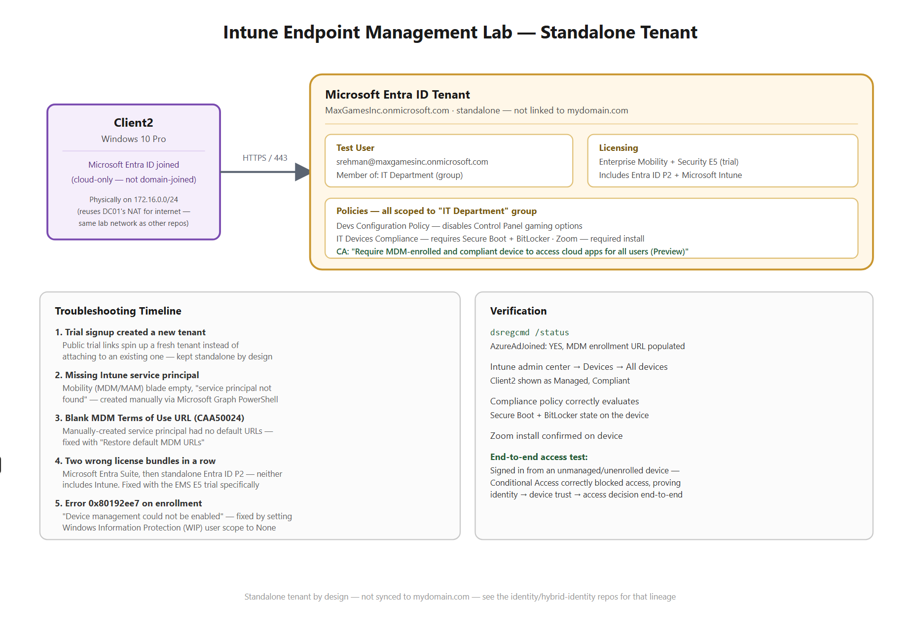

**Related repos:** [Active-Directory-Home-Lab](https://github.com/sibghatrehman/Active-Directory-Home-Lab) and the hybrid identity lab cover on-prem AD and Entra Connect sync in `mydomain.com`. This project is intentionally a **separate tenant** (see Troubleshooting #1 for why) — it stands alone as a device-management deep dive rather than an extension of that identity work.

## Overview

Most of the real work in this project turned out to be diagnosing tenant provisioning and licensing issues rather than clicking through the Intune console — which ended up making it the most troubleshooting-heavy of the three lab projects. That trail is documented in full below.

| | |
|---|---|
| **Tenant** | `MaxGamesInc.onmicrosoft.com` (standalone) |
| **Licensing** | Enterprise Mobility + Security E5 (trial) — bundles Entra ID P2 + Microsoft Intune |
| **Test user** | `srehman@maxgamesinc.onmicrosoft.com` |
| **Enrolled device** | `Client2` — Windows 10 Pro, Microsoft Entra ID joined (cloud-only) |
| **Group** | `IT Department` — scoping group for user, device, and all policies |

## Architecture

- `Client2` is Entra ID joined only — deliberately **not** domain-joined, to keep this a clean cloud-native enrollment rather than a hybrid join (see the Intune build guide notes on why hybrid join was avoided)
- It's physically hosted on the same `172.16.0.0/24` internal network as the AD DS and hybrid identity VMs, reusing DC01's NAT for internet access — no new networking was needed for this project
- Logically, though, it lives in a completely separate Entra tenant (`MaxGamesInc.onmicrosoft.com`), unconnected to `mydomain.com`

## Build Steps

### 1. Tenant & Licensing
- EMS E5 free trial activated and assigned to the test user — this specific bundle was reached only after two wrong attempts (see Troubleshooting)
- Automatic MDM enrollment enabled: Devices → Enrollment → Automatic Enrollment → MDM user scope = **All**, WIP user scope = **None**

### 2. Device Enrollment
- `Client2` provisioned as a fresh Windows 10 Pro VM (not domain-joined)
- Settings → Accounts → Access work or school → joined to Entra ID as the test user
- Automatic Intune enrollment completed as part of the same flow

### 3. Group & Policy Assignment
All policies scoped to the **IT Department** group (contains both the test user and the device):

| Policy | Type | What it does |
|---|---|---|
| **Devs Configuration Policy** | Device configuration profile | Disables gaming options in Control Panel |
| **IT Devices Compliance** | Compliance policy | Requires Secure Boot and BitLocker enabled |
| **Zoom** | App deployment | Required install |
| *"Require MDM-enrolled and compliant device to access cloud apps for all users (Preview)"* | Conditional Access | Blocks cloud app access unless the signed-in device is enrolled and compliant |

### 4. Verification
```powershell
dsregcmd /status
```
Confirms `AzureAdJoined: YES` and populated MDM enrollment URLs.

- Intune admin center → Devices → All devices — `Client2` shown as Managed, Compliant
- Zoom install confirmed present on the device
- **End-to-end access test:** signed in from an unmanaged, never-enrolled device — Conditional Access correctly blocked access, proving the full chain (identity → device trust → access decision) rather than just individual settings in isolation

## Troubleshooting

This project surfaced more real, distinct issues than either of the other two labs — worth reading as a sequence, since each one taught something different about how Intune actually provisions in a tenant.

**1. Trial signup created an entirely new tenant**
Claiming a trial through a public signup link (rather than from inside an existing admin session) spins up a brand-new tenant instead of attaching to one already in use. Decided to keep this project standalone rather than migrate, since the device-management story doesn't depend on synced AD identities.

**2. Missing Intune service principal**
Mobility (MDM and MAM) blade was empty and Automatic Enrollment returned "service principal not found." Microsoft doesn't always auto-provision the Intune service principal for new tenants. Fixed by creating it directly via Microsoft Graph:
```powershell
Connect-MgGraph -Scopes 'Application.ReadWrite.All'
$body = @{ appId = '0000000a-0000-0000-c000-000000000000' } | ConvertTo-Json
Invoke-MgGraphRequest -Method POST -Uri 'https://graph.microsoft.com/v1.0/servicePrincipals' -Body $body -ContentType 'application/json'
```

**3. Couldn't elevate PowerShell on the Entra-joined VM itself**
Typing cloud admin credentials into the local UAC "enter admin credentials" prompt fails even with a correct password — that dialog validates against local SAM, not Entra ID; cloud accounts only get elevated rights through an active, signed-in session (Primary Refresh Token), not through that credential box. Workaround: ran the Graph commands from a different machine entirely (SyncServer01) — tenant/licensing changes via Graph don't care what device or domain they're run from.

**4. Blank MDM Terms of Use URL (`CAA50024`)**
The manually-created service principal came with no default MDM URLs configured, breaking the enrollment terms-of-use step. Fixed via Mobility (MDM and MAM) → Microsoft Intune → **Restore default MDM URLs** → Save.

**5. Two wrong license bundles in a row**
First activated **Microsoft Entra Suite** (assumed it would cover everything) — it's identity/network-security only (ID Governance, Private Access, Internet Access, Verified ID, ID Protection P2) and has never included Intune. Then activated a **standalone Entra ID P2** trial — also identity-only. Intune requires its own explicit inclusion in a license bundle; only the **EMS E5** trial actually bundles it in alongside P2.

**6. Enrollment error `0x80192ee7` ("device management could not be enabled")**
Occurred even with correct licensing and a working service principal. Fixed by setting **Windows Information Protection (WIP) user scope** to **None** on the Mobility (MDM and MAM) → Microsoft Intune screen — a separate setting from MDM user scope that can independently block the enrollment handshake.

## Screenshots

1. `Devices → All devices` — Client2 listed, Managed by Intune, Compliant 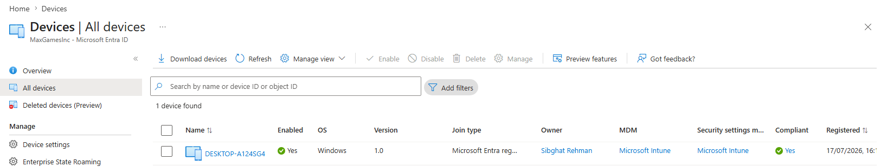 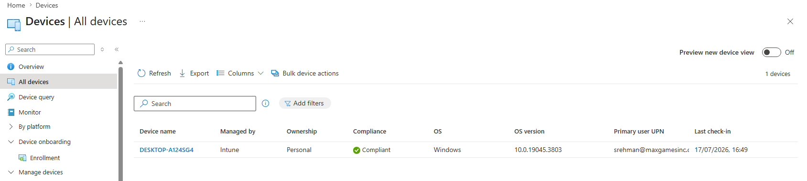
2. Devs Configuration Policy — overview + assignment to IT Department 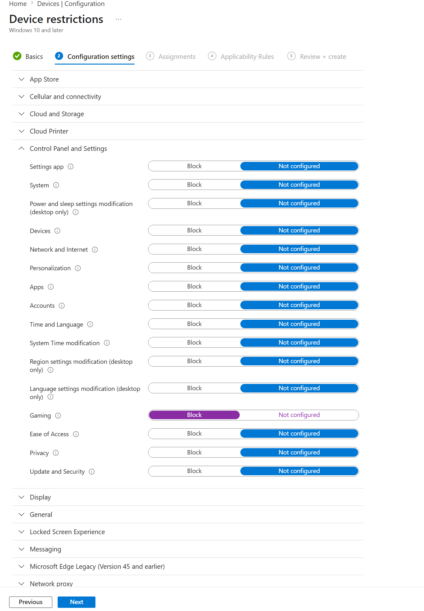
3. IT Devices Compliance — overview + assignment 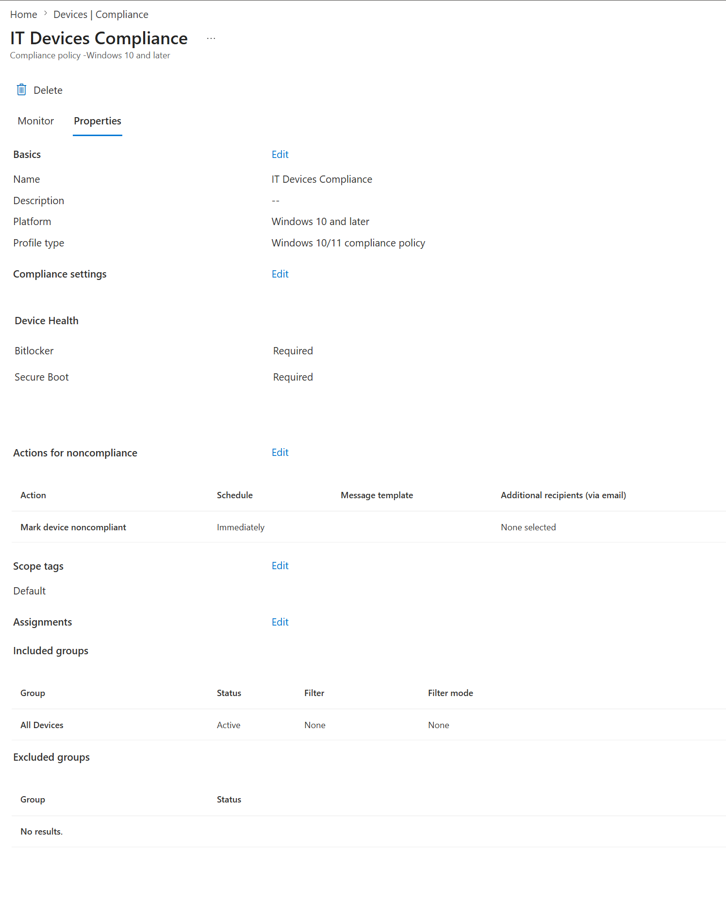
4. Zoom app — Required assignment + install status on Client2 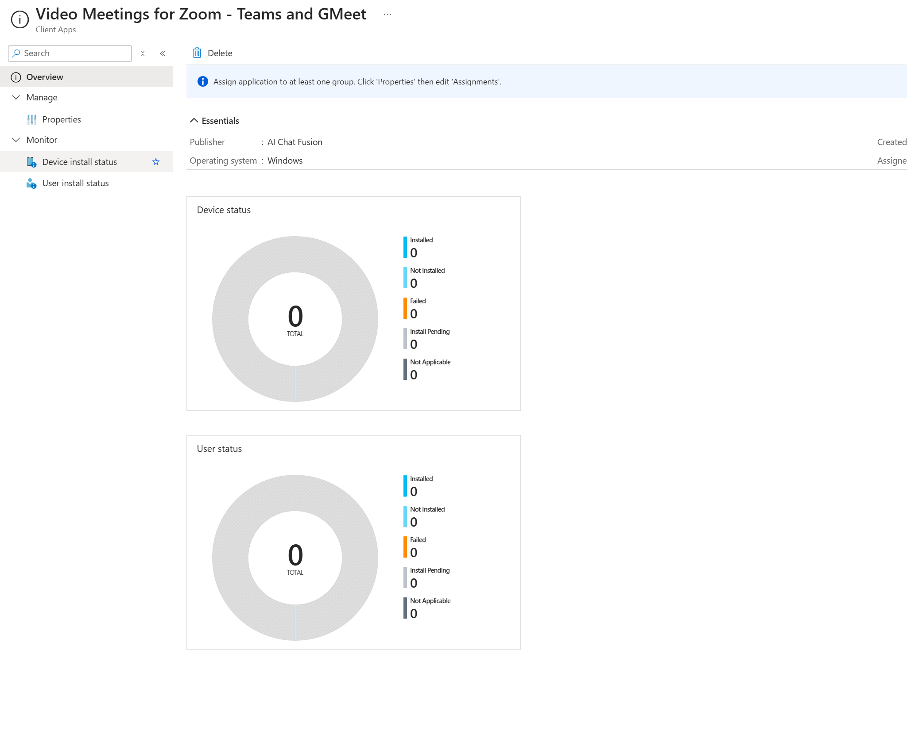
5. Conditional Access policy — conditions + assignment 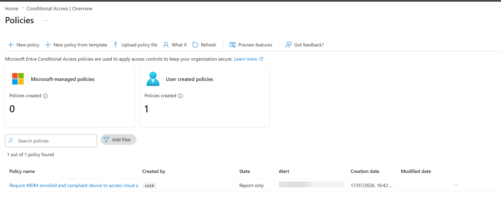
6. `dsregcmd /status` output on Client2 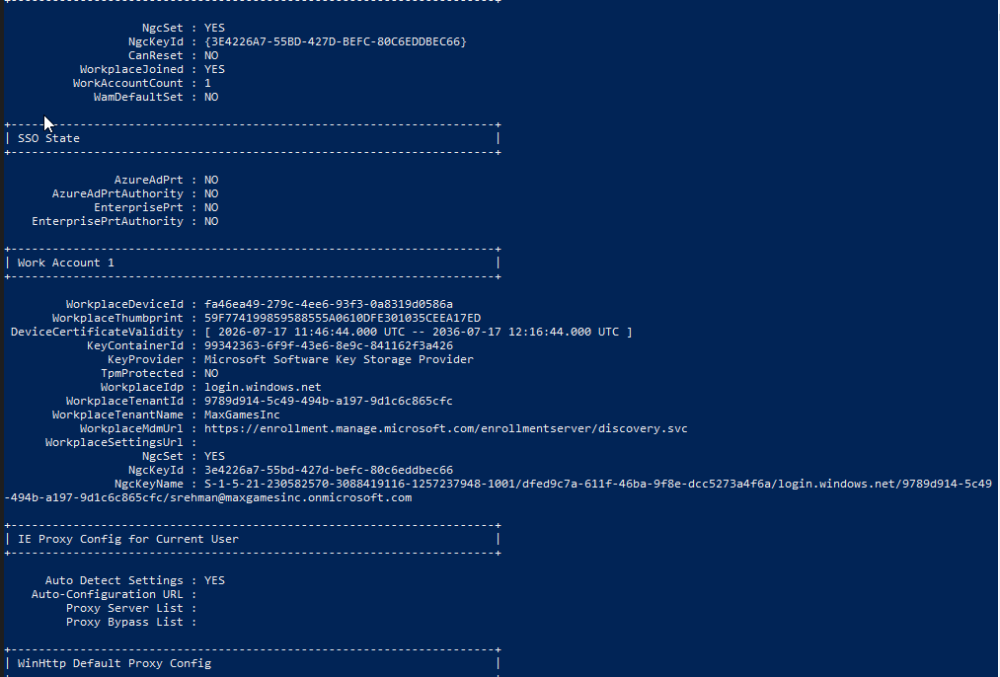
7. Licenses page showing the final EMS E5 trial assignment 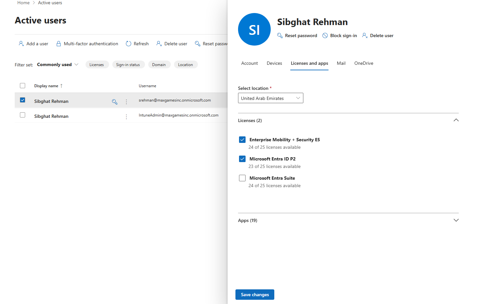
8. MDM URL Error.   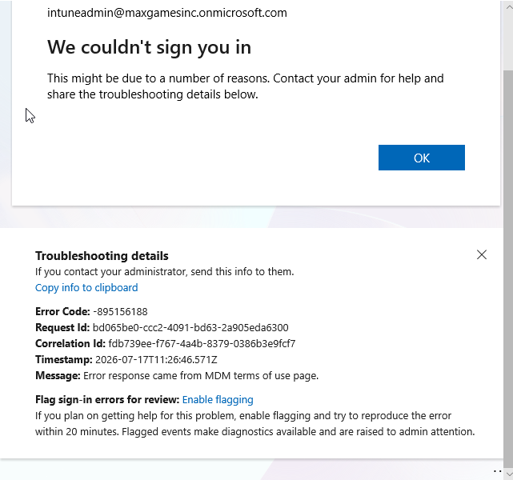
9. Update Ring.  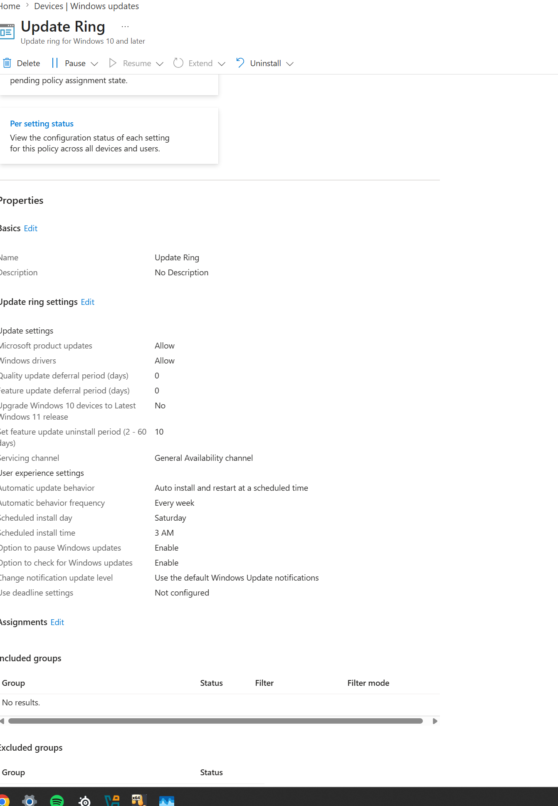
## Skills Demonstrated

`Microsoft Intune` · `Conditional Access` · `Device Compliance Policies` · `Device Configuration Profiles` · `App Deployment` · `Microsoft Graph / PowerShell` · `Entra ID Licensing` · `MDM Enrollment Troubleshooting`

## Resources Used

- Andy Malone (MVP) — *New to Microsoft Intune? Start Here! Complete Beginner Guide 2026* — primary walkthrough
- Microsoft Learn — Intune quickstart: enroll a Windows device — official enrollment reference
- Microsoft Q&A community threads — used to diagnose the service principal, `CAA50024`, and `0x80192ee7` errors


